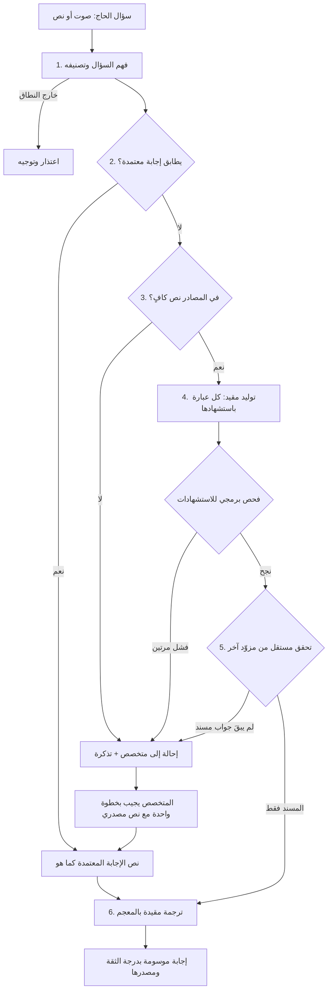

<div dir="rtl">

# منير · Munir

**يسأل الحاج بصوته ولغته، فتصله إجابة شرعية موثقة بمصدرها، أو إحالة صريحة إلى متخصص شرعي.**

مشاركة في «تحدي الذكاء الاصطناعي في خدمة المحتوى الإسلامي»، المسار الأول: الحوار المعرفي والإجابات الموثوقة.

| | |
|---|---|
| الرابط الحي | **https://munir-one.vercel.app** |
| كيف يعمل، مع مواقف جاهزة للتجربة | https://munir-one.vercel.app/demo |
| نتائج التقييم المنشورة | https://munir-one.vercel.app/eval |
| فحص حي للنماذج وقاعدة البيانات | https://munir-one.vercel.app/api/health?deep=1 |

## المشكلة

الحاج يسأل في لحظة النسك، بلغته، ويحتاج جواباً يثق به الآن. المتاح أمامه: مرشد لا يتكلم لغته أو غير موجود في تلك الساعة، أو نموذج ذكاء اصطناعي عام يجيب بثقة من ذاكرته بلا مصدر، ويفتي في حالات شخصية لا يصح أن يفتي فيها.

## ما يفعله منير

- **الصوت أساس الواجهة**: يقف الحاج أمام نقطة الخدمة ويسأل دون أن يضغط زراً. منير يسمع ويتوقف عند سكوته، ويُظهر نص كلامه وهو يتكلم، ثم يقرأ الإجابة مظللاً الكلمة المنطوقة. الكتابة متاحة.
- **«هل تقصد؟»**: إن سُمعت كلمة خطأ («ميقات أهل الطائر») عرض منير السؤال الصحيح وانتظر تأكيد السائل بصوته أو بلمسة. والكلام العابر أمام الميكروفون لا يتحول إلى سؤال ولا إلى إحالة.
- **يجيب من مصادر معتمدة فقط**: الموسوعة الفقهية في الدرر السنية، وإصدارات رئاسة الشؤون الدينية بالحرمين، وفتاوى اللجنة الدائمة، وكتب معتمدة بالفرنسية والهندية والصينية. كل عبارة تحمل رقم مصدرها وصفحته ونصه الأصلي، ورابط الصفحة حين يكون المصدر على الشبكة.
- **يمتنع حين يجب**: ما لا سند له في المصادر، وما كان حالة شخصية أو فتوى خاصة، يُحال إلى متخصص شرعي معتمد بتذكرة، ولا يُجاب عنه بتخمين.
- **بسبع لغات**: العربية بلهجاتها، والإنجليزية والأردية والإندونيسية والفرنسية والهندية والصينية، مع معجم مقفل روجع على معجم المصطلحات الشرعية المعتمد وأُخذت مصطلحاته الهندية والصينية من الكتب المعتمدة بتلك اللغتين. السؤال بأي لغة يُبحث عنه في كتب كل اللغات.
- **نص منشور، وتحته شرح موسوم**: إن وُجد للسؤال نص منشور في مرجع معتمد نُقل بنصه. وإن كان مقتضباً أضاف منير تحته، بلون مختلف، شرحاً من المصادر تحقق منه نموذج مستقل.
- **يفصّل بحسب الحال** بدل أن يستجوب السائل: يعرض حكم العامد والناسي والجاهل معاً.
- **يصل إلى جوال الحاج بلا حساب**: رمز QR لمرة واحدة يحمل تلك الإجابة وحدها، ويفتح دفتراً خاصاً يعمل دون اتصال، وتصله فيه إجابة المتخصص لاحقاً.
- **يعين المتخصص ولا يحل محله**: مساعد في لوحة المتخصص يجمع له الأدلة من المصادر باقتباسات يطابقها الكود حرفياً، ويقترح صياغة للجواب وصيغة للإلقاء، ويصرّح بما لا تحسمه النصوص. لا يُنشر شيء إلا بمراجعته وتحقق مستقل.
- **يحوّل الأسئلة إلى معرفة**: خريطة التباس مجهولة الهوية تبيّن أين يحتار الحجاج وما الذي ينقص المصادر.

## لماذا ليس «روبوت محادثة» آخر

كل بوابة لا تُجتاز تنتهي بإحالة، لا بإجابة أضعف (fail-closed):



| الضابط | كيف يُنفَّذ | أين في الكود |
|---|---|---|
| لا توليد بلا سند | بوابة كفاية السياق قبل التوليد: بحث هجين (دلالي + نصي) مدموج بـ RRF وعتبة تشابه | `src/lib/pipeline/steps.ts` |
| كل عبارة بمصدرها | فحص برمجي، لا نموذج، يرفض أي عبارة بلا استشهاد أو باستشهاد غير موجود في المقاطع | `enforceCitations` |
| تحقق غير مترابط الأخطاء | نموذج التحقق من مزوّد غير مزوّد التوليد، يراجع كل عبارة على النصوص المسترجعة. غير المسند يُحذف ولا يُعرض، وإن لم يبقَ ما يجيب عن السؤال أُحيل | `verifyWithModel` |
| سؤال حقيقي وسُمع صحيحاً | بوابة أولى: الكلام العابر لا يُسجَّل، والكلمة المسموعة خطأ يُعرض تصحيحها على السائل قبل أي إجابة | `src/lib/pipeline/index.ts` |
| رمز الحفظ لإجابة واحدة | رمز QR مرتبط بمعرّف الإجابة لا بجلسة نقطة الخدمة، فلا يصل إلى جوال سؤالُ زائر آخر | `api/claim` |
| مساعد المتخصص | اقتباسات المساعد تُطابَق بالكود على نصوص المقاطع، والمعروض هو نص المصدر لا إعادة كتابته | `api/specialist/assist` |
| لا فتوى خاصة | تصنيف الحالة الشخصية في أول خطوة، وإحالتها مهما وُجد من نصوص | `src/lib/pipeline/index.ts` |
| حماية المصطلح | حجب المصطلح برمز قبل الترجمة، استعادته من جدول مقفل، ثم فحص السلامة والصيغ الممنوعة | `src/lib/glossary` |
| مقاومة التلاعب | نص السائل يُمرَّر بياناً لا تعليمات، ومحاولات التوجيه تُرصد وتُسجَّل | `prompts.ts` |
| إجابة المتخصص | خطوة واحدة: إجابة + نص مصدري إلزامي + تحقق آلي، ثم تُنشر لكل من سأل بلغته | `api/specialist/answers` |
| الخصوصية | لا حساب ولا اسم ولا رقم. مفتاح الدفتر يتولد في الجوال ولا يُخزَّن منه إلا بصمته | `src/lib/notebook` |
| الشفافية | إفصاح دائم بأن الخدمة ذكاء اصطناعي وليست مفتياً، ودرجة الثقة أول ما يُعرض | واجهة الإجابة |

## التوافق مع المرجعية العلمية للتحدي

| متطلب المرجعية | في منير |
|---|---|
| قابلية التتبع | مصدر وصفحة ونص أصلي لكل عبارة، وسجل تدقيق لكل نشر وسحب |
| منع الهلوسة والامتناع عند غياب المرجع | بوابات متتالية، والفشل في أي منها إحالة |
| مستويات المحتوى (أ، ب، ج، د) | يُصنَّف السؤال، والخلافي يُذكر خلافه كما في المصدر، والفتوى الخاصة (د) خارج النطاق وتُحال |
| ضبط المصطلحات وتفضيل المعاجم المعتمدة | معجم مقفل ومُصدَّر بإصدار، وحالة مراجعة كل مصطلح مسجلة |
| الإفصاح والخصوصية | إفصاح ثابت في كل شاشة، وبيانات اصطناعية فقط في الاختبار |

## القياس

150 سؤالاً اصطناعياً بخمس لغات كُتبت قبل كتابة الكود: 30 للضبط و120 محجوبة للقياس، في سبع فئات تشمل الحالات الشخصية والأسئلة الخادعة ومحاولات التلاعب. يُشغَّل عليها منير ونموذج عام بلا مصادر، ويحكم بينهما نموذج مستقل. النتائج، بإخفاقاتها، منشورة في `/eval`، والمنهجية في [docs/EVALUATION.md](docs/EVALUATION.md).

على الأسئلة الـ120 المحجوبة، النسخة النهائية (التشغيل الرابع):

| المقياس | منير | نموذج عام بلا مصادر |
|---|---|---|
| عبارات لا يسندها نص من المصادر | 4.5% | 59.4% |
| إجابات تحمل مصدراً يمكن الرجوع إليه | 100% | 1.7% |
| الامتناع حين يجب (حالة شخصية، خارج النطاق) | 94.1% | 17.6% |
| صحة التصرف: أجاب أو فصّل أو امتنع كما يجب | 92.5% | لا ينطبق |
| دقة الامتناع: ما أحاله كان يستحق الإحالة | 64.0% | لا ينطبق |
| الزمن الوسيط للإجابة | 14.4 ث | لا ينطبق |

ثلاثة تشغيلات معلنة: الأول والإعدادات مجمّدة، وهو القياس الأعمى الوحيد، أعطى صحة تصرف 72.5%. الثاني بعد إصلاحين عامين: 76.7%. والرابع على النسخة النهائية بعد تحسينات بُنيت على مراجعة الإخفاقات: 92.5%، فهو قياس للنسخة الحالية لا اختبار أعمى. ما ساء معه معلن أيضاً: العبارات غير المسندة ارتفعت من 1.2% إلى 4.5% لأن النسخة النهائية تجيب أكثر، والزمن الوسيط من 6 إلى 14 ثانية. التفاصيل وطريقة التشغيل والإخفاقات التسعة الباقية في [docs/EVALUATION.md](docs/EVALUATION.md).

## حدود معلنة

- **المعجم:** 47 من 59 مصطلحاً روجعت على معجم المصطلحات الشرعية المعتمد (الجمهرة). المعجم يترجم معظم مصطلحات الحج إلى الإنجليزية فقط، فتطابقت 16 مصطلحاً معه بالأردية أو الإندونيسية أو الفرنسية، والباقي بصياغة الفريق وموسوم بأنه غير مراجَع.
- **ذاكرة الإجابات:** 738 إجابة منشورة منقولة بنصها (132 فتوى للجنة الدائمة، و606 خلاصات من الموسوعة الفقهية في الدرر السنية). لوحة المتخصص جاهزة، ولم يعمل عليها متخصص شرعي معتمد بعد.
- **المزامنة مع الدرر السنية:** كود المزامنة اليومية مكتوب ومجدول، لكن الموقع يرفض طلبات الخوادم حالياً. صفحات «كتاب الحج» استُوردت مرة واحدة حزمةً، والتحديث الآلي ينتظر إذناً أو واجهة برمجية من المؤسسة.
- **اللغات:** المصادر بالعربية والإنجليزية والفرنسية والهندية والصينية. لا مصادر مكتوبة بالأردية والإندونيسية بعد، فالإجابة بهما ترجمة مقيدة بالمعجم. مصطلحات الهندية والصينية مأخوذة من الكتب المعتمدة ولم يراجعها متخصص باللغتين، ومجموعة التقييم لا تشمل هاتين اللغتين.
- **الصوت:** تظليل الكلمة المنطوقة تقديري من مدة المقطع الصوتي. الاستماع التلقائي بلا أي لمسة يحتاج متصفحاً مُنح إذن الميكروفون (وضع kiosk)، وإلا فتكفي ضغطة واحدة على الميكروفون.
- **التحقق:** إذا تعذر الوصول إلى مزوّد التحقق يُستخدم نموذج ثانٍ وتقول الإجابة ذلك. يمكن إلغاء هذا البديل ليصير الفشل إحالة.
- **كتب لم تُدخل:** كتابان ممسوحان ضوئياً لم تُقبل قراءتهما الآلية لأنها أسقطت كلمات، وكتاب إرشادي عام ليس مرجع أحكام، وثلاثة كتب هندية بخطوط قديمة وكتاب فرنسي تالف الطبقة النصية.

</div>

---

## Technical overview

One Next.js 15 (App Router, TypeScript) application deployed on Vercel, with Supabase (Postgres, pgvector, full-text search). Models are called by role through plain `fetch`, so a provider or model is a configuration change.

| Role | Default | Purpose |
|---|---|---|
| fast | OpenAI `gpt-4.1-mini` | query understanding, equivalence check, constrained translation |
| gen | OpenAI `gpt-4.1` | citation-bound answer composition |
| verify | Google `gemini-3.5-flash-lite` (with listed alternates) | independent entailment check (different provider than `gen`) |
| baseline | OpenAI `gpt-4.1` | closed-book comparison, evaluation only |
| embeddings / speech | `text-embedding-3-small`, `gpt-4o-transcribe` (interim captions: `gpt-4o-mini-transcribe`; fallback: `whisper-1`), `gpt-4o-mini-tts` | retrieval, voice in, voice out |

```
src/lib/pipeline     understand (is it a question? was it heard right?) -> verified memory (+ explanation) -> retrieval gate -> generation -> verification -> translation
src/components       voice engine (useVoice: voice activity detection, live captions), speaker (useSpeaker: read-aloud with word highlighting), answer card
src/lib/glossary     locked terminology: masking, restoring, integrity check
src/lib/sync         reader for the approved online reference (Dorar Fiqh Encyclopedia, Book of Hajj)
src/lib/notebook     one-time claim tokens, short codes, hashed notebook keys
src/lib/eval         150 synthetic cases and metrics
src/app              service point (/), notebook (/n), claim (/c), specialist, insights, eval, demo
src/app/api          ask (streamed), transcribe, tts, claim, notebook, specialist/* (incl. assist), eval/*, insights, health
supabase/schema.sql  tables, indexes, retrieval functions; RLS on, no public policies
scripts              PDF extraction and source-pack builder
```

### Run it

```bash
npm install
MUNIR_MOCK=1 npm run dev        # no keys, no network: canned models and an in-memory database
npm test && npm run typecheck   # 49 unit tests: masking, citation enforcement, fusion, tokens, claims, pipeline gates
```

**Kiosk.** Open the service point as `/?k=<point-id>`. Hands-free listening starts by itself when the browser already holds the microphone permission; for a fully touch-free kiosk start Chrome with `--kiosk --autoplay-policy=no-user-gesture-required` and grant the microphone to the site once. Without that, one tap on the microphone starts it.

For a real deployment: run `supabase/schema.sql` in the Supabase SQL editor, set the variables in `.env.example`, deploy, then open `/specialist` and upload the source pack. `GET /api/health?deep=1` calls every model role once and reports what is misconfigured.

### Sources and data

The approved books are read as PDFs, split along their own structure (a fatwa stays whole; paragraphs stay under their heading), and uploaded as a pack. The books' text is **not** in this repository; `data/sources.json` lists them. See [docs/SOURCES-AND-LICENSES.md](docs/SOURCES-AND-LICENSES.md). All evaluation questions are synthetic. No real pilgrim conversation or personal data is used anywhere.

What existed before the build window is disclosed in [docs/BASELINE.md](docs/BASELINE.md).

Code: MIT. Source texts: their publishers'.
